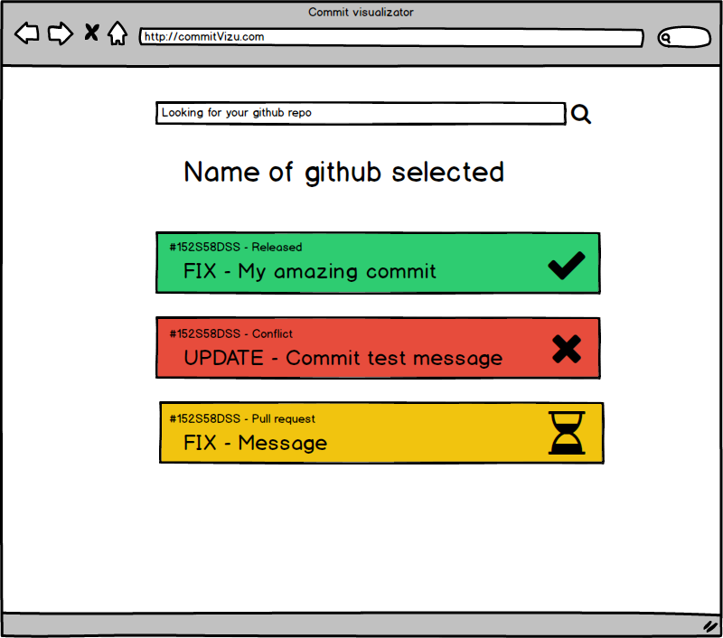

# ColabLog

This project was generated with [Angular CLI](https://github.com/angular/angular-cli) version 7.3.8.

# Web site model


The website is composed of :

- Searchbar to search a repo git url and bind this to display data of this
- Label to display the name of the repo git 
- Display area to show the data from commit , like commit id , commit message 

# Tree structure of application

    .
    ├── src                     # Source files (alternatively `lib` or `app`)
      ├── app                   # Where is a main app 
        ├── core                # Core of the app
        ├── feature             # Feature of the app
          ├── searchbar         # Name of the feature 
            ├── service         # Service of the feature
            ├── component       # Component file
            ├── model           # Data model
        ├── share               # Shared data model
    └── README.md

> Use short lowercase names at least for the top-level files and folders except
> , `README.md`

# Git flow
```bash
> [ ADD ]     # is for adding file(s) or other
> [ UPDATE ]  # is for updating file(s)
> [ FIX ]     # is for fixing bug 
> [ DELETE ]  # is for delete file(s)
```

## Development server

Run `ng serve` for a dev server. Navigate to `http://localhost:4200/`. The app will automatically reload if you change any of the source files.

## Code scaffolding

Run `ng generate component component-name` to generate a new component. You can also use `ng generate directive|pipe|service|class|guard|interface|enum|module`.

## Build

Run `ng build` to build the project. The build artifacts will be stored in the `dist/` directory. Use the `--prod` flag for a production build.

## Running unit tests

Run `ng test` to execute the unit tests via [Karma](https://karma-runner.github.io).

## Running end-to-end tests

Run `ng e2e` to execute the end-to-end tests via [Protractor](http://www.protractortest.org/).

## Further help

To get more help on the Angular CLI use `ng help` or go check out the [Angular CLI README](https://github.com/angular/angular-cli/blob/master/README.md).

# changelog_viewer

Add the [setup file](/../../raw/master/setup/ChangelogViewerGIT.setup) to the github projetcs of your eclipse installer


